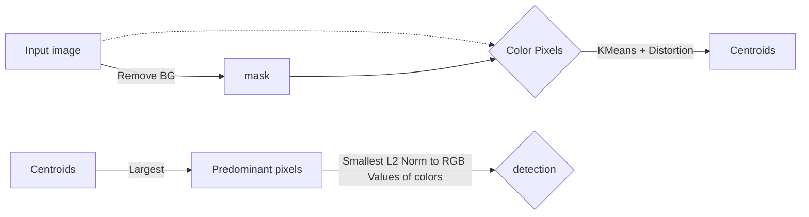

# Color Detection via Euclidean Distance

[![N|Solid] (detection.png)]

This is a python script that detects the predominant color of an object in an image. In this specific aplication, we are detecting color of vehicles.

## Pipeline

## Files

## Results

